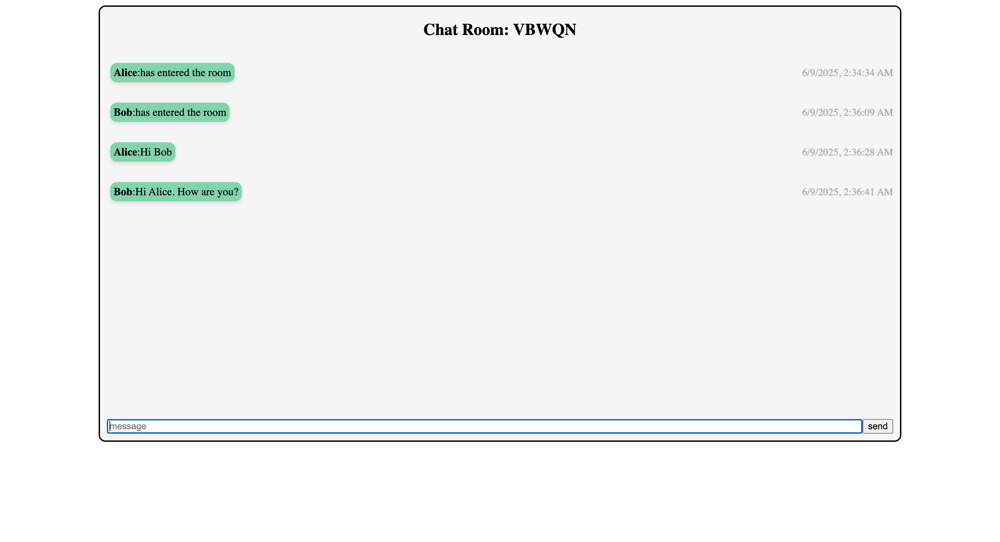

# 💬 Real-Time Chat Room App with Flask & Socket.IO

This is a real-time chat room web application built using **Flask** and **Flask-SocketIO**. Users can create or join chat rooms using a unique code, exchange messages in real time, and leave the room anytime. This project demonstrates the core concepts of WebSocket communication and real-time broadcasting in a lightweight Python-based backend.

## 📁 Project Structure

- `chat-app/`
  - `static/`
    - `style.css` – Styling for chat pages
  - `templates/`
    - `base.html` – Base layout
    - `home.html` – Home page (create/join room)
    - `room.html` – Room chat interface
  - `app.py` – Main Flask app with Socket.IO integration
  - `README.md` – Project documentation

## 🔧 Tech Stack

- **Backend**: Flask, Flask-SocketIO
- **Frontend**: HTML, CSS, JavaScript
- **Templating Engine**: Jinja2
- **Real-time Communication**: WebSockets via Socket.IO

## 📸 Screenshots

| Home Page | Chat Room |
|-----------|-----------|
|  |  |

> _Screenshots are just examples — replace with your own from `/static/assets/` or update accordingly._

## 🚀 Features

- ✅ Create or join chat rooms using a room code
- ✅ Real-time message updates using Socket.IO
- ✅ Auto-removal of empty rooms
- ✅ Responsive and minimal user interface
- ✅ Clean template structure using Jinja2

## 🧠 How It Works

- When a user joins or creates a room, they are assigned a session ID.
- Messages are broadcasted to everyone connected to that room using Socket.IO.
- When the last user leaves, the room is automatically deleted from memory.

## 🛡️ Security & Limitations

- Room and message data is stored **in-memory** — restarting the server will reset everything.
- No user authentication or persistent chat history (can be added later with a database).

## 📘 Future Enhancements

- Add user authentication
- Integrate a database (e.g., PostgreSQL or MongoDB)
- Display chat history
- Add emojis, typing indicators, and file sharing
